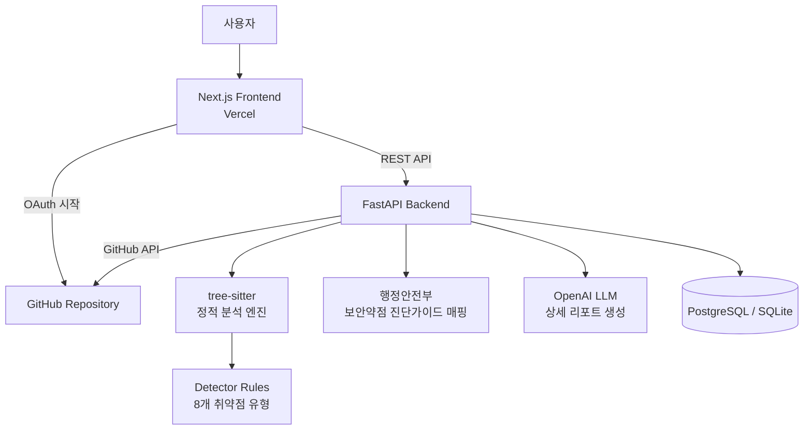

# DoUSECURE Backend

[](https://github.com/Capstone-P17/backend/actions/workflows/backend-ci.yml)

DoUSECURE는 Java 소스코드를 대상으로 보안 취약점을 정적 분석하고, 행정안전부 「소프트웨어 보안약점 진단가이드(2019.6 개정)」 기준의 탐지 근거와 수정 방향을 제공하는 소스코드 취약점 분석 서비스입니다.


## 주요 기능

- GitHub 저장소, 단일 Java 파일, 압축 파일 업로드 분석
- `tree-sitter-java` 기반 AST 파싱과 rule-based detector 실행
- SQL Injection, XSS, Path Traversal, Command Injection, Dangerous File Upload 등 8개 detector 지원
- 공식 보안약점 진단가이드 항목, confidence, evidence 매핑
- OpenAI API 설정 시 정적 분석 근거 기반 LLM 상세 리포트 생성
- PDF 리포트 다운로드와 분석 결과 조회 API 제공

## 아키텍처



## 분석 엔진 구조

실제 서비스에서 사용하는 정적 분석 진입점은 `src/app/services/static_analysis/runner.py`입니다.
각 취약점 탐지는 `src/app/services/static_analysis/detectors/` 아래의 개별 detector 모듈에서 수행합니다.

```text
src/app/services/static_analysis/
  runner.py                 # 파일/디렉터리 분석 진입점
  parser.py                 # tree-sitter-java 파싱과 AST 유틸리티
  call_graph.py             # Java 메서드 호출 그래프 생성
  detectors/                # 취약점별 rule-based detector
```

`src/analyzer/test_samples/`는 회귀 테스트와 시연용 Java 샘플 위치입니다. 이전에 사용하던 레거시 `src/analyzer/analyzer.py` 분석기는 제거되었고, 서비스 실행 경로에는 포함되지 않습니다.

## LLM 역할

DoUSECURE의 취약점 탐지는 LLM이 아니라 `tree-sitter-java` 기반 rule-based detector가 수행합니다.
LLM은 detector가 만든 코드 위치, 호출 경로, evidence, 공식 가이드 매핑을 근거로 상세 설명과 수정 가이드를 생성하는 리포트 계층입니다.

`OPENAI_API_KEY`가 비어 있거나 LLM 호출이 실패해도 정적 분석 결과는 유지되며, detector metadata 기반 fallback 설명과 수정 예시가 제공됩니다.

- [LLM 역할과 Grounding 정책](docs/llm-role-and-grounding.md)
- [Source/Sink/Sanitizer 탐지 모델](docs/source-sink-sanitizer-model.md)

## 공식 가이드 기준

현재 구현은 행정안전부 「소프트웨어 보안약점 진단가이드(2019.6 개정)」의 구현단계 보안약점 항목을 기준으로 detector를 매핑합니다.

- [공식 보안약점 진단가이드 매핑 테이블](docs/security-guide-mapping.md)
- [공식 벤치마크 검증 요약](docs/benchmark-validation.md)

## 빠른 실행

```bash
cp .env.example .env
uv sync
uv run uvicorn src.main:app --host 0.0.0.0 --port 8000
```

실행 후 확인:

- Backend health: `http://localhost:8000`
- Swagger UI: `http://localhost:8000/docs`
- Capabilities: `http://localhost:8000/capabilities`

## 환경 변수

로컬 실행에는 최소한 다음 값을 채워야 합니다.

```env
JWT_SECRET_KEY="32바이트 이상 랜덤 문자열"
DATABASE_URL="sqlite:///./app.db"
ALLOWED_ORIGINS=["http://localhost:3000"]
```

선택 항목:

- `OPENAI_API_KEY`: LLM 리포트 생성 사용 시 필요
- `GITHUB_CLIENT_ID`, `GITHUB_CLIENT_SECRET`: GitHub OAuth 로그인 사용 시 필요
- `LOG_LEVEL`: 로컬 디버깅 시 `DEBUG`로 설정하면 요청, 분석 파이프라인, 정적 분석, LLM 리포트 생성 흐름을 더 자세히 확인할 수 있음
- `LOG_FILE_ENABLED=true`: 콘솔 외에 `LOG_FILE_PATH`로 지정한 파일에도 회전 로그 저장

## Docker 실행

```bash
docker compose up --build
```

- `backend`: `8000` 포트로 실행
- `db`: PostgreSQL 16 기준으로 함께 실행
- Docker Compose 환경에서는 백엔드 컨테이너가 `db` 서비스로 DB에 연결됩니다.

## API 문서

상세 API 목록은 서버 실행 후 Swagger UI에서 확인하는 것을 권장합니다.

- Swagger UI: `http://localhost:8000/docs`
- 요약 문서: [docs/api.md](docs/api.md)

## 테스트

```bash
uv run pytest
```

테스트 범위에는 detector, 분석 API, 인증, 리포트, 공식 벤치마크 샘플 검증이 포함됩니다.

## 팀 역할

역할은 기능 영역 기준으로 관리합니다.

- 정적 분석 엔진 및 detector 설계
- 공식 보안약점 진단가이드 매핑과 벤치마크 검증
- FastAPI 서비스 계층, 인증, 분석 결과 저장
- PDF 리포트 생성
- Next.js 프론트엔드와 분석 결과 시각화
